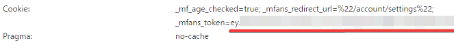
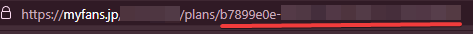

# mfsdl

A Tools for download videos from myfans.

## Installation

```console
cargo install --git https://github.com/ekuinox/mfsdl
```

**And it requires `ffmpeg` command in `$PATH` env var.**

## Usage

Get token from cookie `_mfans_token`



And set token to `$MYFANS_TOKEN` env var.

Open myfans plan and get `plan_id` from url.



And start download with below command.

```console
mfsdl --plan-id <COPIED_PLAN_ID> --output <OUTPUT_DIRECTORY>
```

---

Thanks [FudgeRK/MyfansDownloader](https://github.com/FudgeRK/MyfansDownloader)
